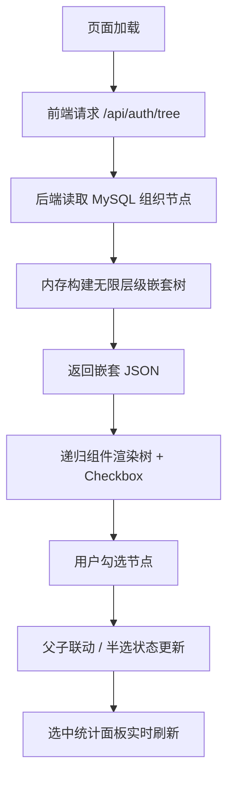

# 组织架构权限树组件 - 产品需求文档（PRD）

## 1. 产品概述
本产品是公司权限管理后台的自研组织架构权限树组件。后端基于 Node.js (Express) + MySQL，从数据库读取组织节点并构建无限层级嵌套的 JSON 树（部门 / 子部门 / 小组 / 员工），通过 `GET /api/auth/tree` 接口对外提供；前端使用 React 递归组件将树渲染为带 HTML Checkbox 的可交互权限树，支持父子联动勾选与实时统计。
- 目标用户：公司权限管理后台的管理员、系统运维与研发人员。
- 产品价值：提供统一的组织视图与细粒度权限勾选能力，替代通用树组件，满足无限层级与权限联动的自研诉求。

## 2. 核心功能

### 2.1 用户角色
| 角色 | 进入方式 | 核心权限 |
|------|---------|---------|
| 权限管理员 | 后台账号登录 | 查看 / 勾选组织树、查看选中统计 |

### 2.2 功能模块
1. **权限树工作台（单页）**：树状视图、勾选联动、检索过滤、选中统计面板。

### 2.3 页面详情
| 页面名称 | 模块名称 | 功能描述 |
|---------|---------|---------|
| 权限树工作台 | 顶部概览栏 | 显示节点总数、部门数、员工数、已勾选数等关键统计 |
| 权限树工作台 | 组织权限树 | 递归渲染嵌套树，每个节点带 HTML Checkbox，支持展开 / 折叠、检索过滤、全部展开 / 折叠 |
| 权限树工作台 | 选中概览面板 | 实时展示已勾选节点列表、按类型分组的数量统计、复制 / 清空操作 |

## 3. 核心流程
1. 页面加载，前端请求 `GET /api/auth/tree`。
2. 后端从 MySQL 一次性读取全部组织节点，在内存中构建无限层级嵌套树并按 `sort_order` 排序，返回 JSON。
3. 前端递归组件渲染树，每个节点渲染 HTML Checkbox。
4. 用户勾选节点：父节点勾选自动联动所有子孙；子孙取消勾选则父节点变为半选（indeterminate）状态。
5. 选中概览面板实时刷新统计与列表。

## 4. 界面设计

### 4.1 设计风格
- 主题：深色「控制台」风格，近黑暖灰底色，jade / emerald 主色（呼应「权限 / 通行」语义），辅以 amber 强调员工节点。
- 按钮：圆角小按钮，主操作 emerald 实色，次操作 ghost 描边。
- 字体：标题用 Instrument Serif（高对比衬线，带斜体气质），UI 用 Geist，数据 / 编码用 JetBrains Mono。
- 布局：左侧主树面板 + 右侧选中概览面板的卡片式双栏，顶部概览栏。
- 图标：lucide-react 线性图标；不同节点类型用色块徽标区分。

### 4.2 页面设计概览
| 页面名称 | 模块名称 | UI 元素 |
|---------|---------|---------|
| 权限树工作台 | 顶部概览栏 | 暖黑背景、统计数据大号 Instrument Serif 数字、标签 mono 小字 |
| 权限树工作台 | 组织权限树 | 卡片容器、树形缩进连线、节点行 hover 高亮、Checkbox 半选态、类型徽标 |
| 权限树工作台 | 选中概览面板 | 滚动列表、类型分组计数条、复制 / 清空按钮、空态插画 |

### 4.3 响应式
桌面优先，窄屏时右侧面板下移为全宽堆叠，树面板保持可横向滚动。

### 4.4 3D 场景
不适用。
