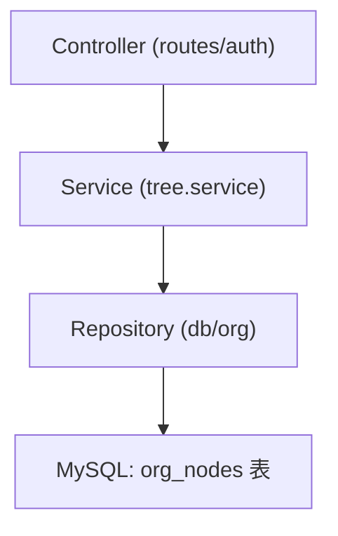
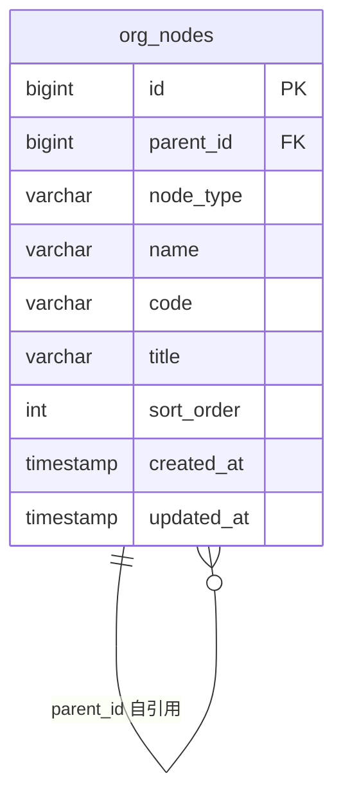

# 组织架构权限树组件 - 技术架构文档

## 1. 架构设计


## 2. 技术说明
- 前端：React@18 + TypeScript + Tailwind CSS + Vite，状态管理 zustand。
- 初始化工具：vite-init（react-express-ts 模板）。
- 后端：Express@4 + TypeScript（ESM），监听 3000 端口；开发期 Vite 代理至后端。
- 数据库：MySQL（mysql2 驱动），通过 `migrations` 目录的 SQL 初始化表结构与种子数据。

## 3. 路由定义
| 路由 | 用途 |
|------|------|
| `/` | 权限树工作台（单页应用） |

## 4. API 定义

### 4.1 GET /api/auth/tree
返回完整的组织架构权限树（无限层级嵌套）。

**请求：** 无参数。

**响应类型：**
```ts
type NodeType = 'department' | 'sub_department' | 'team' | 'employee';

interface TreeNode {
  id: number;
  parentId: number | null;
  nodeType: NodeType;
  name: string;
  code: string | null;
  title: string | null;
  sortOrder: number;
  children: TreeNode[];
}

interface ApiResponse {
  code: number;
  message: string;
  data: TreeNode[];
}
```

**实现要点：** 后端一次性 `SELECT * FROM org_nodes`，在内存中用 `Map<parentId, nodes[]>` 组装并按 `sort_order` 排序，避免 N+1 查询，支持无限层级嵌套。

## 5. 服务端架构图


## 6. 数据模型

### 6.1 数据模型定义


### 6.2 数据定义语言
```sql
CREATE TABLE IF NOT EXISTS org_nodes (
  id BIGINT UNSIGNED NOT NULL AUTO_INCREMENT,
  parent_id BIGINT UNSIGNED NULL,
  node_type VARCHAR(20) NOT NULL COMMENT 'department/sub_department/team/employee',
  name VARCHAR(100) NOT NULL,
  code VARCHAR(50) NULL,
  title VARCHAR(100) NULL,
  sort_order INT NOT NULL DEFAULT 0,
  created_at TIMESTAMP DEFAULT CURRENT_TIMESTAMP,
  updated_at TIMESTAMP DEFAULT CURRENT_TIMESTAMP ON UPDATE CURRENT_TIMESTAMP,
  PRIMARY KEY (id),
  KEY idx_parent (parent_id),
  KEY idx_type (node_type),
  CONSTRAINT fk_org_parent FOREIGN KEY (parent_id) REFERENCES org_nodes(id) ON DELETE CASCADE
) ENGINE=InnoDB DEFAULT CHARSET=utf8mb4;
```

种子数据包含一个集团根节点及其下若干部门 / 子部门 / 小组 / 员工，演示无限层级嵌套。
